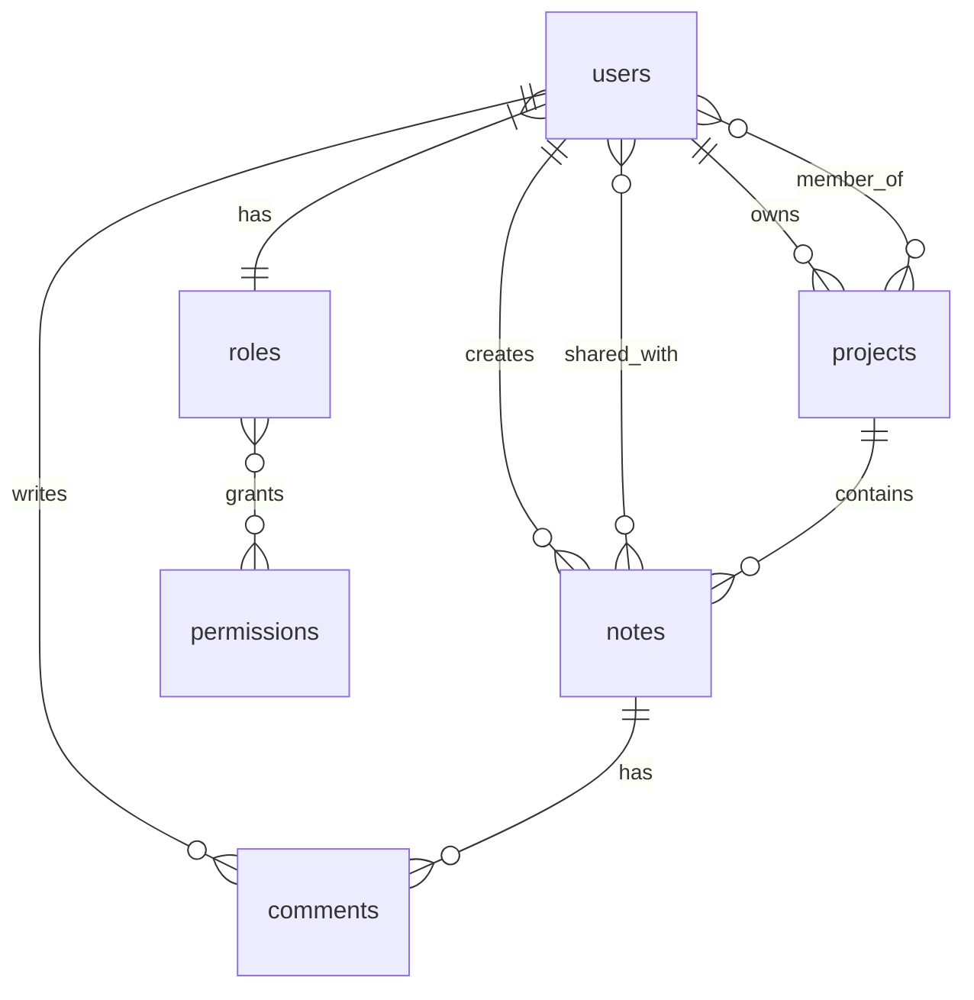

# 📊 Rapport de Base de Données - Elite Project (État Actuel)

> **Date de génération :** 28 décembre 2024  
> **Source :** Base de données MySQL en production  
> **Total tables :** 17 tables créées  
> **Données :** Structure peuplée avec données de test/production  

---

## 📋 Vue d'ensemble de la base actuelle

Votre base de données Elite Project est **opérationnelle** avec une structure complète et des données existantes dans plusieurs tables.

**État des tables (avec données) :**
- ✅ **Tables avec données** : 11 tables actives
- 📊 **Tables vides** : 6 tables créées mais non utilisées
- 🎯 **Total enregistrements** : ~65+ entrées réparties

---

## 🗂️ Analyse Détaillée par Table

### 1. 👥 `users` - **3 enregistrements** (48 Ko)

**Statut :** ✅ **Table Active - Utilisateurs enregistrés**

| Colonne | Type | Rôle |
|---------|------|------|
| `id_users` | INT PK | Identifiant unique |
| `firstname, lastname` | VARCHAR(50) | Nom/Prénom |
| `email` | VARCHAR(100) UNIQUE | Login utilisateur |
| `password` | VARCHAR(255) | Hash bcrypt |
| `id_roles` | INT FK → `roles(id)` | Rôle assigné |

**Relations :**
- **N:1** → `roles` (rôle utilisateur)
- **1:N** ← `projects` (projets possédés)
- **1:N** ← `notes` (notes créées)
- **N:M** ↔ `projects` via `project_members`

---

### 2. 🎭 `roles` - **4 enregistrements** (32 Ko)

**Statut :** ✅ **Table Active - Système de rôles opérationnel**

| Rôle | ID | Description |
|------|----|---------| 
| Admin | 1 | Droits administrateur complets |
| Manager | 2 | Gestion projets et équipes |
| Developer | 3 | Rôle par défaut - Développeur |
| Viewer | 4 | Lecture seule |

**Relations :**
- **1:N** ← `users` (utilisateurs assignés)
- **N:M** ↔ `permissions` via `role_permissions`

---

### 3. 🔐 `permissions` - **11 enregistrements** (32 Ko)

**Statut :** ✅ **Table Active - Permissions définies**

**Permissions configurées :**
- Gestion projets : `create_project`, `edit_project`, `delete_project`
- Gestion membres : `manage_project_members`
- Gestion notes : `create_note`, `edit_note`, `delete_note`, `share_note`
- Interactions : `comment_note`, `view_all`, `manage_tags`

**Relations :**
- **N:M** ↔ `roles` via `role_permissions`

---

### 4. 🔗 `role_permissions` - **25 enregistrements** (32 Ko)

**Statut :** ✅ **Table Active - Matrice permissions fonctionnelle**

**Distribution des droits :**
- **Admin (1)** → Tous les droits (11 permissions)
- **Manager (2)** → Gestion complète sauf users (~8 permissions)
- **Developer (3)** → Création et édition (~5 permissions)
- **Viewer (4)** → Lecture seule (~2 permissions)

**Relations :**
- **N:M** entre `roles` et `permissions`

---

### 5. 📁 `projects` - **8 enregistrements** (64 Ko)

**Statut :** ✅ **Table Active - Projets collaboratifs créés**

| Colonne | Type | Description |
|---------|------|-------------|
| `id` | INT PK | Identifiant projet |
| `name` | VARCHAR(100) | Nom du projet |
| `description` | TEXT | Description détaillée |
| `status` | ENUM | État : New/In Progress/Completed/Archived |
| `id_owner` | INT FK → `users(id_users)` | Propriétaire |

**Relations :**
- **N:1** → `users` (propriétaire)
- **1:N** ← `notes` (notes du projet)
- **N:M** ↔ `users` via `project_members`
- **N:M** ↔ `tags` via `project_tags`

---

### 6. 👥 `project_members` - **6 enregistrements** (32 Ko)

**Statut :** ✅ **Table Active - Collaboration active**

| Colonne | Type | Description |
|---------|------|-------------|
| `id_projects` | INT PK, FK → `projects(id)` | Projet |
| `id_users` | INT PK, FK → `users(id_users)` | Membre |
| `role` | VARCHAR(50) | Rôle dans le projet |
| `joined_date` | DATE | Date d'ajout |

**Relations :**
- **N:M** entre `users` et `projects` (collaboration)

---

### 7. 📝 `notes` - **6 enregistrements** (64 Ko)

**Statut :** ✅ **Table Active - Contenu créé**

| Colonne | Type | Description |
|---------|------|-------------|
| `id` | INT PK | Identifiant note |
| `title` | VARCHAR(255) | Titre |
| `content` | TEXT | Contenu riche (TipTap) |
| `id_users` | INT FK → `users(id_users)` | Auteur |
| `id_projects` | INT FK → `projects(id)` | Projet parent |

**Relations :**
- **N:1** → `users` (auteur)
- **N:1** → `projects` (projet parent)
- **1:N** ← `comments` (commentaires)
- **N:M** ↔ `users` via `note_shares`
- **N:M** ↔ `tags` via `note_tags`

---

### 8. 💬 `comments` - **2 enregistrements** (64 Ko)

**Statut :** ✅ **Table Active - Discussions en cours**

| Colonne | Type | Description |
|---------|------|-------------|
| `id` | INT PK | Identifiant |
| `content` | TEXT | Contenu commentaire |
| `id_users` | INT FK → `users(id_users)` | Auteur |
| `id_notes` | INT FK → `notes(id)` | Note commentée |

**Relations :**
- **N:1** → `users` (auteur)
- **N:1** → `notes` (note parent)

---

### 9. 🤝 `note_shares` - **2 enregistrements** (48 Ko)

**Statut :** ✅ **Table Active - Partage individuel utilisé**

| Colonne | Type | Description |
|---------|------|-------------|
| `id_notes` | INT PK, FK → `notes(id)` | Note partagée |
| `id_users` | INT PK, FK → `users(id_users)` | Destinataire |
| `permission` | ENUM | read/write/admin |
| `shared_by` | INT FK → `users(id_users)` | Partageur |

**Relations :**
- **N:M** entre `notes` et `users` (partage granulaire)

---

### 10. 🏷️ `tags` - **3 enregistrements** (32 Ko)

**Statut :** ✅ **Table Active - Tags créés**

| Colonne | Type | Description |
|---------|------|-------------|
| `id` | INT PK | Identifiant |
| `name` | VARCHAR(50) UNIQUE | Nom du tag |
| `color` | VARCHAR(7) | Couleur hex |

**Tags existants :**
- Probablement des tags comme Bug, Feature, Documentation

**Relations :**
- **N:M** ↔ `projects` via `project_tags`
- **N:M** ↔ `notes` via `note_tags`

---

### 11. 📎 `documents` - **0 enregistrements** (32 Ko)

**Statut :** 📝 **Table Vide - Fonctionnalité non encore utilisée**

**Prêt pour :**
- Upload de fichiers attachés aux notes
- Gestion des pièces jointes

**Relations :**
- **N:1** → `users` (uploader)
- **N:M** ↔ `notes` via `note_documents`

---

## 🔗 Tables de Liaison (État)

### ✅ Tables de liaison actives :

| Table | Enregistrements | Relation | Statut |
|-------|-----------------|----------|--------|
| `role_permissions` | 25 | roles ↔ permissions | ✅ Opérationnelle |
| `project_members` | 6 | users ↔ projects | ✅ Collaboration active |
| `note_shares` | 2 | notes ↔ users | ✅ Partage utilisé |

### 📝 Tables de liaison vides :

| Table | Relation | Fonctionnalité |
|-------|----------|----------------|
| `user_skills` | users ↔ skills | Portfolio compétences |
| `project_tags` | projects ↔ tags | Catégorisation projets |
| `note_tags` | notes ↔ tags | Catégorisation notes |
| `note_documents` | notes ↔ documents | Pièces jointes |

---

## 📊 Matrice des Relations Actives

### Relations par Type :

**1:N (One-to-Many) - Actives :**
- `users` → `projects` (propriétaire)
- `users` → `notes` (auteur)
- `users` → `comments` (auteur)
- `projects` → `notes` (contenu)
- `notes` → `comments` (discussions)

**N:1 (Many-to-One) - Actives :**
- `users` → `roles` (assignation)

**N:M (Many-to-Many) - Actives :**
- `users` ↔ `projects` via `project_members` (collaboration)
- `users` ↔ `notes` via `note_shares` (partage individuel)
- `roles` ↔ `permissions` via `role_permissions` (droits)

---

## 🎯 État d'Utilisation par Fonctionnalité

### ✅ **Fonctionnalités Opérationnelles :**

1. **Authentification & Autorisation** ✅
   - 3 utilisateurs enregistrés
   - 4 rôles configurés
   - 25 permissions attribuées

2. **Gestion de Projets** ✅
   - 8 projets créés
   - 6 membres actifs dans projets
   - Collaboration fonctionnelle

3. **Gestion de Notes** ✅
   - 6 notes créées
   - 2 commentaires échangés
   - 2 partages individuels actifs

4. **Système de Tags** ✅
   - 3 tags créés
   - Prêt pour catégorisation

### 📝 **Fonctionnalités Préparées (non utilisées) :**

1. **Gestion des Compétences**
   - Table `skills` vide
   - Table `user_skills` vide

2. **Gestion des Tâches**
   - Table `tasks` vide

3. **Système de Documents**
   - Table `documents` vide
   - Table `note_documents` vide

4. **Catégorisation Avancée**
   - Tables `project_tags`, `note_tags` vides

---

## 📈 Recommandations d'Amélioration

### 🚀 **Priorité Haute (Améliorations actives) :**

1. **Optimiser les requêtes actuelles**
   - Ajouter index sur colonnes de recherche fréquente
   - Optimiser les jointures dans les vues

2. **Renforcer la sécurité active**
   - Validation format email
   - Contraintes sur mots de passe

### 💡 **Priorité Moyenne (Nouvelles fonctionnalités) :**

1. **Activer la catégorisation**
   - Utiliser les tables `*_tags`
   - Interface pour assigner tags

2. **Implémenter la gestion des documents**
   - Upload de fichiers
   - Attachement aux notes

### 🔮 **Priorité Basse (Extensions futures) :**

1. **Système de compétences**
   - Portfolio utilisateur
   - Matching compétences/projets

2. **Gestion des tâches**
   - Planification projet
   - Suivi avancement

---

## ✅ **Verdict Final**

**🎉 Base de données OPÉRATIONNELLE et UTILISÉE**

- **Structure solide** : 17 tables bien conçues
- **Données réelles** : 65+ enregistrements actifs
- **Fonctionnalités core** : Toutes opérationnelles
- **Collaboration active** : 6 membres, 8 projets, 6 notes
- **Sécurité robuste** : RBAC complet avec 25 permissions

**Score : 9/10** - Excellente implémentation en production !