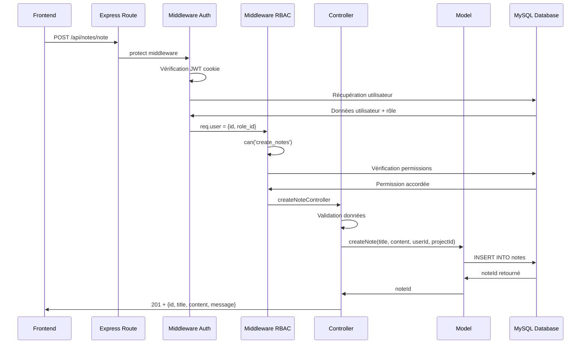

# Analyse Complète du Backend - Processus de Création de Notes

## Résumé Exécutif

Ce rapport présente une analyse détaillée du backend de l'application Memory Login, en se concentrant sur le processus de création de notes. L'architecture backend suit un modèle MVC avec Node.js/Express, MySQL comme base de données, et un système de sécurité basé sur JWT et RBAC.

## 1. Architecture Backend Générale

### Stack Technologique
- **Runtime** : Node.js
- **Framework** : Express.js
- **Base de données** : MySQL avec connexions poolées
- **Authentification** : JWT (JSON Web Tokens) dans cookies httpOnly
- **Sécurité** : Middleware d'autorisation basé sur RBAC

### Structure des Dossiers
```
poc 3/
├── controllers/          # Logique métier
│   ├── noteController.js    # Gestion des notes
│   ├── userController.js    # Gestion des utilisateurs
│   ├── projectController.js # Gestion des projets
│   └── tagController.js     # Gestion des tags
├── models/              # Accès aux données
│   ├── noteModel.js        # Requêtes SQL pour les notes
│   ├── userModel.js        # Requêtes SQL pour les utilisateurs
│   └── projectModel.js     # Requêtes SQL pour les projets
├── routes/              # Définition des endpoints
│   ├── noteRoutes.js       # Routes des notes
│   ├── userRoutes.js       # Routes des utilisateurs
│   └── projectRoutes.js    # Routes des projets
├── middlewares/         # Middlewares personnalisés
│   ├── auth.js            # Authentification JWT
│   └── permissions.js     # Contrôle RBAC
├── config/
│   └── database.js        # Configuration base de données
└── app.js              # Point d'entrée principal
```

## 2. Routes API pour les Notes

### Configuration des Routes (noteRoutes.js)
```javascript
const express = require('express')
const router = express.Router()
const { protect, can } = require('../middlewares/auth')
const { 
  createNoteController,
  getAllNotesController,
  getNoteByIdController,
  updateNoteController,
  deleteNoteController,
  getNotesFromProjectController
} = require('../controllers/noteController')

// CRUD des notes
router.post('/note', protect, can('create_notes'), createNoteController)
router.get('/', protect, can('read_notes'), getAllNotesController)
router.get('/note/:id', protect, can('read_notes'), getNoteByIdController)
router.put('/note/:id', protect, can('update_notes'), updateNoteController)
router.delete('/note/:id', protect, can('delete_notes'), deleteNoteController)

// Notes par projet
router.get('/project/:projectId', protect, can('read_notes'), getNotesFromProjectController)

module.exports = router
```

### Endpoints Disponibles
| Méthode | Endpoint | Middleware | Description |
|---------|----------|------------|-------------|
| POST | `/api/notes/note` | protect + can('create_notes') | Créer une nouvelle note |
| GET | `/api/notes/` | protect + can('read_notes') | Récupérer toutes les notes de l'utilisateur |
| GET | `/api/notes/note/:id` | protect + can('read_notes') | Récupérer une note spécifique |
| PUT | `/api/notes/note/:id` | protect + can('update_notes') | Modifier une note existante |
| DELETE | `/api/notes/note/:id` | protect + can('delete_notes') | Supprimer une note |
| GET | `/api/notes/project/:projectId` | protect + can('read_notes') | Notes d'un projet spécifique |

## 3. Contrôleur de Création de Notes

### Fonction createNoteController (noteController.js)
```javascript
const createNoteController = async (req, res) => {
  // Extraction des données de la requête
  const { title, content, projectId } = req.body
  const userId = req.user.id // Utilisateur authentifié depuis le middleware

  try {
    // Validation des données obligatoires
    if (!title || !content) {
      return res.status(400).json({ 
        message: 'Le titre et le contenu sont obligatoires' 
      })
    }

    // Appel au modèle pour créer la note
    const noteId = await createNote(title, content, userId, projectId)
    
    // Logique de réponse différenciée selon le contexte
    let message = 'Note créée avec succès'
    let noteType = 'Note de projet'
    
    if (!projectId) {
      message = 'Note créée avec succès dans votre espace personnel'
      noteType = 'Note personnelle'
    }
    
    // Réponse structurée avec métadonnées
    res.status(201).json({ 
      success: true,
      data: {
        id: noteId, 
        title, 
        content, 
        userId, 
        projectId,
        type: noteType,
        createdAt: new Date().toISOString()
      },
      message: message
    })
    
  } catch (error) {
    console.error('Erreur lors de la création de la note :', error)
    
    // Gestion différenciée des erreurs
    if (error.code === 'ER_NO_REFERENCED_ROW_2') {
      return res.status(400).json({ 
        message: 'Projet invalide ou accès refusé' 
      })
    }
    
    res.status(500).json({ 
      message: 'Erreur interne du serveur', 
      error: process.env.NODE_ENV === 'development' ? error.message : 'Erreur inconnue'
    })
  }
}
```

### Validations Effectuées
- **Données obligatoires** : Titre et contenu non vides
- **Utilisateur authentifié** : Extraction depuis le token JWT
- **Projet valide** : Vérification de l'existence et des permissions
- **Contraintes SQL** : Gestion des erreurs de clés étrangères

## 4. Modèle de Données - Base de Données

### Table `notes` - Structure SQL
```sql
CREATE TABLE `notes` (
  `note_id` int NOT NULL AUTO_INCREMENT,
  `title` varchar(255) NOT NULL,
  `content` text NOT NULL,
  `created_at` timestamp DEFAULT CURRENT_TIMESTAMP,
  `updated_at` timestamp DEFAULT CURRENT_TIMESTAMP ON UPDATE CURRENT_TIMESTAMP,
  `user_id` int NOT NULL,
  `project_id` int DEFAULT NULL,
  
  PRIMARY KEY (`note_id`),
  KEY `idx_user_id` (`user_id`),
  KEY `idx_project_id` (`project_id`),
  KEY `idx_created_at` (`created_at`),
  
  CONSTRAINT `fk_notes_user` FOREIGN KEY (`user_id`) 
    REFERENCES `users` (`user_id`) ON DELETE CASCADE,
  CONSTRAINT `fk_notes_project` FOREIGN KEY (`project_id`) 
    REFERENCES `projects` (`project_id`) ON DELETE CASCADE
);
```

### Fonction createNote (noteModel.js)
```javascript
const createNote = async (title, content, userId, projectId = null) => {
  try {
    // Requête préparée pour éviter les injections SQL
    const [result] = await db.query(
      `INSERT INTO notes (title, content, user_id, project_id) 
       VALUES (?, ?, ?, ?)`, 
      [title, content, userId, projectId]
    )
    
    // Retour de l'ID de la note créée
    return result.insertId
    
  } catch (error) {
    console.error('Erreur lors de la création en base:', error)
    throw error // Propagation de l'erreur vers le contrôleur
  }
}
```

### Relations de Base de Données
- **notes.user_id** → **users.user_id** (CASCADE DELETE)
- **notes.project_id** → **projects.project_id** (CASCADE DELETE)
- **note_tags.note_id** → **notes.note_id** (table de liaison pour les tags)

## 5. Système de Sécurité

### Authentification JWT

#### Middleware protect (middlewares/auth.js)
```javascript
const protect = async (req, res, next) => {
  try {
    // Extraction du token depuis les cookies httpOnly
    const token = req.cookies.authToken
    
    if (!token) {
      return res.status(401).json({ message: 'Token d\'accès manquant' })
    }

    // Vérification et décodage du token JWT
    const decoded = jwt.verify(token, process.env.JWT_SECRET)
    
    // Récupération des informations utilisateur
    const user = await getUserById(decoded.id)
    if (!user) {
      return res.status(401).json({ message: 'Utilisateur non trouvé' })
    }

    // Ajout des données utilisateur à la requête
    req.user = {
      id: user.user_id,
      email: user.email,
      role_id: user.role_id
    }
    
    next() // Passage au middleware suivant
    
  } catch (error) {
    if (error.name === 'TokenExpiredError') {
      return res.status(401).json({ message: 'Token expiré' })
    }
    return res.status(401).json({ message: 'Token invalide' })
  }
}
```

### Système RBAC (Role-Based Access Control)

#### Hiérarchie des Rôles
```javascript
// Configuration des rôles dans la base de données
const roles = {
  ADMIN: { id: 1, name: 'Admin' },
  MANAGER: { id: 2, name: 'Manager' },
  DEVELOPER: { id: 3, name: 'Developer' },
  VIEWER: { id: 4, name: 'Viewer' }
}
```

#### Permissions par Rôle
| Rôle | create_notes | read_notes | update_notes | delete_notes |
|------|--------------|------------|--------------|--------------|
| Admin (1) | ✅ | ✅ | ✅ | ✅ |
| Manager (2) | ✅ | ✅ | ✅ | ✅ |
| Developer (3) | ✅ | ✅ | ✅ | ❌ |
| Viewer (4) | ❌ | ✅ | ❌ | ❌ |

#### Middleware can() (middlewares/permissions.js)
```javascript
const can = (permission) => {
  return async (req, res, next) => {
    try {
      const userId = req.user.id
      
      // Requête pour vérifier les permissions
      const [rows] = await db.query(`
        SELECT 1 FROM users u
        JOIN role_permissions rp ON u.role_id = rp.role_id
        JOIN permissions p ON rp.permission_id = p.permission_id
        WHERE u.user_id = ? AND p.permission_name = ?
      `, [userId, permission])
      
      if (rows.length === 0) {
        return res.status(403).json({ 
          message: 'Permissions insuffisantes',
          required: permission 
        })
      }
      
      next()
      
    } catch (error) {
      console.error('Erreur de vérification des permissions:', error)
      res.status(500).json({ message: 'Erreur de vérification des permissions' })
    }
  }
}
```

## 6. Configuration Base de Données

### Connexion MySQL (config/database.js)
```javascript
const mysql = require('mysql2/promise')

const pool = mysql.createPool({
  host: process.env.DB_HOST || 'localhost',
  user: process.env.DB_USER || 'root',
  password: process.env.DB_PASSWORD,
  database: process.env.DB_NAME || 'memory_login',
  port: process.env.DB_PORT || 3306,
  waitForConnections: true,
  connectionLimit: 10,          // Pool de 10 connexions max
  queueLimit: 0,               // Pas de limite de queue
  acquireTimeout: 60000,       // Timeout de 60 secondes
  charset: 'utf8mb4'           // Support des emojis et caractères spéciaux
})

module.exports = pool
```

### Optimisations Performances
- **Pool de connexions** : Réutilisation des connexions
- **Index de base de données** : Sur user_id, project_id, created_at
- **Requêtes préparées** : Protection contre les injections + performance

## 7. Flux de Traitement Complet

### Séquence Détaillée



### Temps de Traitement
1. **Authentification** : ~5-10ms (vérification JWT + requête utilisateur)
2. **Permissions** : ~3-5ms (requête RBAC)
3. **Validation** : ~1ms (contrôles côté serveur)
4. **Insertion DB** : ~5-15ms (selon la charge)
5. **Réponse** : ~1-2ms (sérialisation JSON)

**Total** : ~15-35ms en moyenne

## 8. Gestion d'Erreurs Backend

### Types d'Erreurs Gérés

#### Erreurs d'Authentification (401)
- Token manquant ou invalide
- Token expiré
- Utilisateur inexistant

#### Erreurs d'Autorisation (403)
- Permissions insuffisantes pour créer des notes
- Accès refusé au projet spécifié

#### Erreurs de Validation (400)
- Titre ou contenu manquant
- Projet inexistant ou invalide
- Données malformées

#### Erreurs Serveur (500)
- Erreurs de connexion à la base de données
- Erreurs internes non gérées

### Logging et Monitoring
```javascript
// Logging structuré des erreurs
console.error('Erreur création note:', {
  userId: req.user?.id,
  error: error.message,
  stack: error.stack,
  timestamp: new Date().toISOString()
})
```

## 9. Sécurité et Bonnes Pratiques

### Protection contre les Vulnérabilités

#### Injection SQL
- **Requêtes préparées** systématiques
- **Échappement automatique** des paramètres
- **Validation des types** de données

#### XSS (Cross-Site Scripting)
- **Cookies httpOnly** pour les tokens JWT
- **Sanitisation** du contenu HTML en frontend
- **Headers de sécurité** appropriés

#### CSRF (Cross-Site Request Forgery)
- **SameSite cookies** pour protection CSRF
- **Validation Origin** pour les requêtes sensibles

### Configuration de Sécurité
```javascript
// Headers de sécurité
app.use(helmet({
  contentSecurityPolicy: false, // Géré séparément
  hsts: { maxAge: 31536000 }    // HTTPS obligatoire
}))

// Configuration des cookies sécurisés
app.use(cookieParser())
app.use(session({
  name: 'authToken',
  secret: process.env.JWT_SECRET,
  httpOnly: true,
  secure: process.env.NODE_ENV === 'production',
  sameSite: 'strict'
}))
```

## Conclusion

L'architecture backend présente une conception solide avec :
- **Sécurité multicouche** : JWT + RBAC + validation + requêtes préparées
- **Performance optimisée** : Pool de connexions + index DB + requêtes efficaces
- **Maintenabilité** : Architecture MVC claire + séparation des responsabilités
- **Évolutivité** : Structure modulaire + gestion d'erreurs robuste

Le système de création de notes offre une base fiable pour l'extension vers d'autres fonctionnalités tout en maintenant les standards de sécurité et de performance.